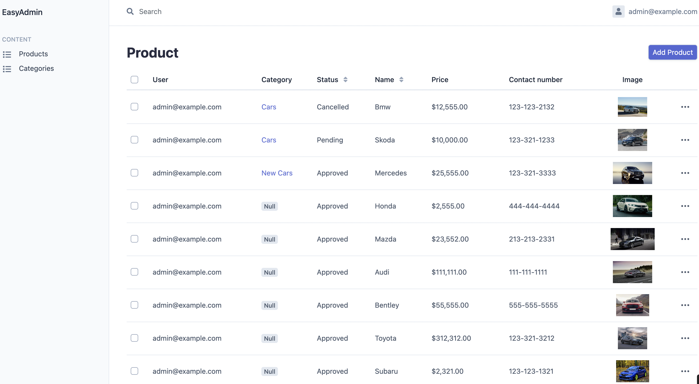

# Site for posting advertisements
## Brief description
### This site allows users to post their advertisements after approval by the administrator.
All ads page:

User ads page:

All ads page (admin):

## Additional extensions:
1. MoneyPHP
2. SCSS
3. Bootstrap
4. Inputmask
5. Symfony Bundles - WebpackEncore, EasyAdmin, KnpPaginator and etc
## Install
1. composer install
2. npm install
3. npm run dev
4. Create .env.local at the root of the directory
5. Copy and fill DATABASE_URL from .env to .env.local
6. php bin/console make:migration
7. php bin/console doctrine:migrations:migrate
8. symfony server:start
9. To create a test administrator follow the link: http://127.0.0.1:8000/create/test/admin
